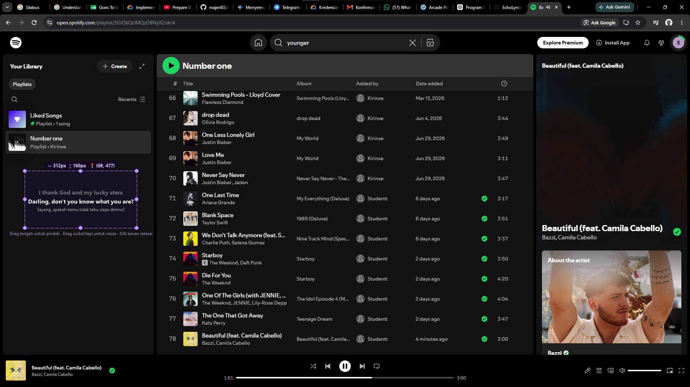
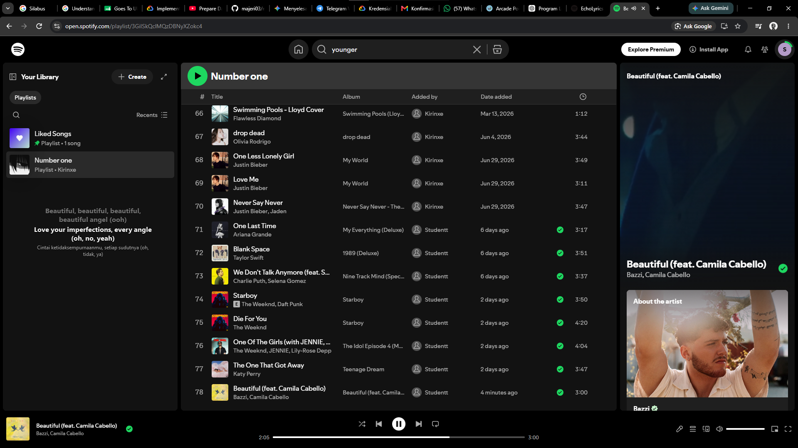
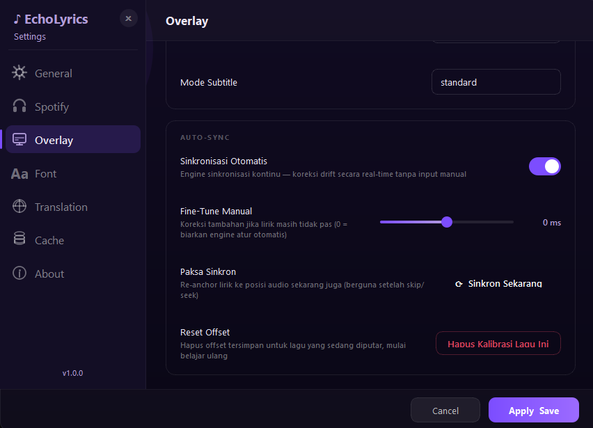
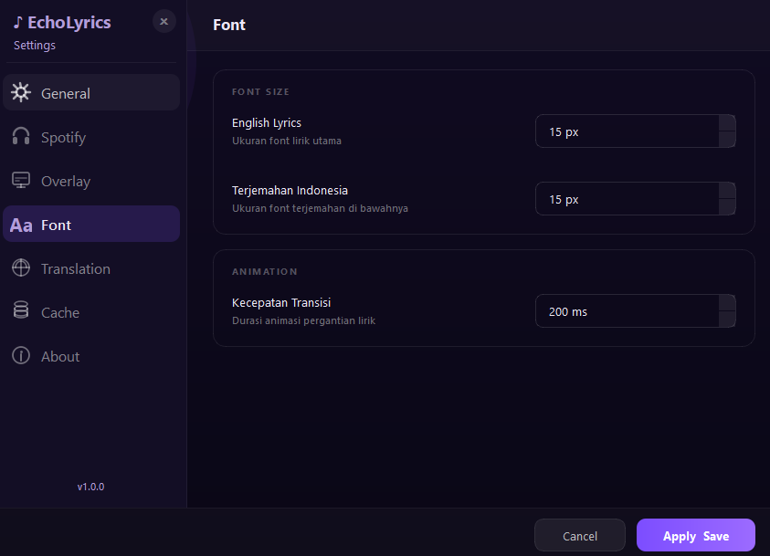
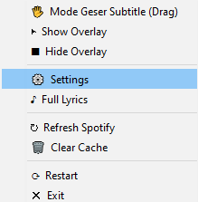

<div align="center">

# 🎵 EchoLyrics

**Application Overlay Lirik Spotify Real-Time untuk Windows dengan Terjemahan Bahasa Indonesia & Kalibrasi Presisi Otomatis.**

*Lirik melayang transparan di atas layar, tersinkronisasi presisi, tanpa border mengganggu, dan adaptif terhadap kecerahan layar.*

[](https://microsoft.com)
[](https://python.org)
[](https://qt.io)
[](https://sqlite.org)
[](https://en.wikipedia.org/wiki/Galois/Counter_Mode)
[](LICENSE)

</div>

---

## 📋 Daftar Isi
- [Apa Itu EchoLyrics?](#-apa-itu-echolyrics)
- [Fitur Utama](#-fitur-utama)
- [Mekanisme Unggulan](#-mekanisme-unggulan)
  - [1. Real-Time Adaptive Brightness Detection](#1-real-time-adaptive-brightness-detection)
  - [2. Adaptive Auto-Sync Calibration Engine](#2-adaptive-auto-sync-calibration-engine)
  - [3. Enkripsi Keamanan Token OAuth 2.0](#3-enkripsi-keamanan-token-oauth-20)
- [Panduan Instalasi & Penggunaan](#-panduan-instalasi--penggunaan)
  - [Opsi A — Memakai Executable (.exe) Siap Pakai](#opsi-a--memakai-executable-exe-siap-pakai)
  - [Opsi B — Menjalankan dari Kode Sumber (Python)](#opsi-b--menjalankan-dari-kode-sumber-python)
- [Panduan Konfigurasi Spotify API (Wajib Pertama Kali)](#-panduan-konfigurasi-spotify-api-wajib-pertama-kali)
- [Struktur & Arsitektur Proyek](#-struktur--arsitektur-proyek)
- [Pintasan Keyboard (Shortcuts)](#-pintasan-keyboard-shortcuts)
- [Panduan Troubleshooting (Solusi Masalah)](#-panduan-troubleshooting-solusi-masalah)
- [Panduan Kompilasi Executable (Untuk Developer)](#-panduan-kompilasi-executable-untuk-developer)
- [Dokumentasi & Tangkapan Layar](#-dokumentasi--tangkapan-layar)
- [Lisensi & Hak Cipta](#-lisensi--hak-cipta)

---

## 💡 Apa Itu EchoLyrics?

**EchoLyrics** adalah aplikasi desktop modern yang dirancang untuk menampilkan lirik lagu yang sedang diputar di Spotify secara mengapung di atas semua jendela aktif (*Always on Top*). 

Dengan tampilan melayang ala subtitle film, terjemahan Bahasa Indonesia yang instan, serta penyesuaian warna teks otomatis terhadap latar belakang layar, Anda dapat menikmati musik dan memahami makna lirik tanpa harus beralih dari pekerjaan utama Anda di browser, game, atau IDE.

---

## ✨ Fitur Utama

| Fitur | Deskripsi |
|-------|-----------|
| 🎯 **Sinkronisasi Presisi Tingkat Tinggi** | Lirik berganti secara akurat mengikuti posisi lagu dengan bantuan `PrecisionTimer` dan *drift corrector*. |
| 🌐 **Terjemahan Bahasa Indonesia** | Menyajikan lirik asli dan terjemahan Bahasa Indonesia secara berdampingan. |
| 👁️ **Adaptive Brightness Detection** | Warna lirik otomatis berganti (hitam saat latar belakang terang, putih saat latar gelap). |
| 🔄 **Auto-Sync Calibration** | Mesin pembelajaran otomatis yang menghitung selisih drift waktu LRC dan menyimpannya ke database. |
| 🍎 **Apple Music Glass UI** | Jendela *Full Lyrics* dengan tampilan kaca buram (*blur/glassmorphism*), visualizer equalizer live, dan animasi cover art. |
| 🖐️ **Mode Drag & Box Resizing** | Bebas geser dan ubah ukuran kotak area subtitle dengan 8 *handle resize* aktif. |
| 👻 **Click-Through Window** | Tetap transparan terhadap klik mouse, sehingga tidak mengganggu interaksi kerja Anda. |
| 💾 **Offline SQLite Cache** | Lirik dan terjemahan yang telah dimuat akan disimpan secara lokal (WAL mode) untuk akses instan berikutnya. |
| 🔐 **Proteksi Keamanan AES-256** | Token kredensial OAuth disandi dengan enkripsi AES-256-GCM berbasis kunci unik mesin. |
| ⚡ **Performa Efisien** | Penggunaan CPU idle < 1% dan memori RAM teroptimasi (< 90 MB). |

---

## ⚙️ Mekanisme Unggulan

### 1. Real-Time Adaptive Brightness Detection
Overlay memantau tingkat kecerahan (*luminance*) layar secara berkala pada koordinat tepat di mana teks subtitle berada:
- **Latar Terang ($Luminance \ge 128$)**: Teks lirik secara otomatis berganti menjadi **hitam pekat `#1A1A1A`** dengan bayangan kontras agar mudah dibaca di atas halaman dokumen atau browser putih.
- **Latar Gelap ($Luminance < 128$)**: Teks lirik berganti menjadi **putih murni `#FFFFFF`** dengan *glow* ungu lembut.

### 2. Adaptive Auto-Sync Calibration Engine
Setiap file LRC di internet sering kali memiliki bias waktu (*systematic latency*) sebesar ±200ms hingga ±1000ms. EchoLyrics dilengkapi dengan `AutoSyncCalibrator`:
- Mengambil sampel selisih waktu antara `PrecisionTimer` internal dan playback status Spotify pada setiap baris lirik.
- Menghitung nilai *median drift* untuk mengeliminasi outlier.
- Menerapkan koreksi offset waktu secara otomatis dan menyimpannya ke database SQLite per lagu (`sync_offset_ms`), sehingga lagu yang sama akan langsung pas sinkronisasinya pada pemutaran berikutnya.

### 3. Enkripsi Keamanan Token OAuth 2.0
Token autentikasi Spotify (`access_token` dan `refresh_token`) tidak pernah disimpan dalam bentuk teks biasa (*plain text*). Kredensial dienkripsi menggunakan algoritma **AES-256-GCM** dengan kunci yang diturunkan dari ID unik perangkat (Hardware UUID) menggunakan PBKDF2. Setiap sesi pemicuan login OAuth juga dilengkapi dengan verifikasi acak `state` untuk melindungi dari serangan CSRF.

---

## 🚀 Panduan Instalasi & Penggunaan

### Opsi A — Memakai Executable (.exe) Siap Pakai
1. Buka tab **[Releases](https://github.com/majeri03/spotify-overlay-lyrics/releases)** di bagian kanan halaman repositori ini.
2. Unduh file rilis terbaru `EchoLyrics.exe`.
3. Jalankan file `EchoLyrics.exe`. Aplikasi akan langsung aktif dan muncul di **System Tray** (pojok kanan bawah taskbar Windows Anda).

---

### Opsi B — Menjalankan dari Kode Sumber (Python)

**Persyaratan Sistem:**
- Windows 10 / 11 (64-bit)
- Python 3.13 atau versi lebih baru
- Spotify Desktop Client atau Spotify Web Player

```bash
# 1. Clone repositori ini
git clone https://github.com/majeri03/spotify-overlay-lyrics.git
cd spotify-overlay-lyrics

# 2. Buat virtual environment (opsional tetapi direkomendasikan)
python -m venv venv
venv\Scripts\activate

# 3. Install semua pustaka dependensi
pip install -r requirements.txt

# 4. Jalankan aplikasi
python main.py
```

---

## 🔑 Panduan Konfigurasi Spotify API (Wajib Pertama Kali)

EchoLyrics memerlukan Kunci API resmi dari Spotify Developer Dashboard untuk berkomunikasi dengan pemutar Spotify Anda:

### Langkah 1 — Buat Aplikasi di Spotify Developer
1. Kunjungi [Spotify Developer Dashboard](https://developer.spotify.com/dashboard) dan login menggunakan akun Spotify Anda.
2. Klik tombol **Create App**.
3. Isi kolom nama aplikasi dengan `EchoLyrics` dan deskripsi singkat.
4. Pada kolom **Redirect URIs**, Anda **WAJIB** mengisikan alamat berikut persis:
   ```text
   http://127.0.0.1:8765/callback
   ```
5. Beri centang pada persetujuan Developer Terms, lalu klik **Save**.
6. Buka tab **Settings** pada aplikasi yang baru dibuat, lalu salin **Client ID** dan **Client Secret**.

### Langkah 2 — Hubungkan ke EchoLyrics
1. Klik kanan ikon **EchoLyrics** di System Tray $\rightarrow$ Pilih **Settings** (atau ikon ⚙️).
2. Buka tab **Spotify**.
3. Masukkan **Client ID** dan **Client Secret** yang telah Anda salin.
4. Klik tombol **Login Spotify**. Browser default Anda akan terbuka untuk meminta otorisasi.
5. Klik **Agree** pada halaman browser. Setelah muncul pesan *"Login berhasil!"*, Anda dapat menutup halaman browser tersebut.

---

## 🏗️ Struktur & Arsitektur Proyek

```text
jlyrics/
├── app/
│   └── app.py                      # Application Bootstrap & Dependency Injection Container
├── backend/
│   ├── config/
│   │   └── config_manager.py       # Thread-safe persistent configuration (RAM -> SQLite)
│   ├── database/
│   │   ├── db_manager.py           # SQLite connection pool (WAL Mode & Foreign Keys)
│   │   ├── migrations.py           # Automatic schema migration manager (v1.0.0 -> v1.1.0)
│   │   └── repositories/           # Data Access Layer (Tracks, Lyrics, Translations, Settings)
│   ├── events/
│   │   ├── event_bus.py            # Central pub/sub Event Bus
│   │   └── event_types.py          # Strongly-typed system event enum definitions
│   ├── logger/
│   │   └── app_logger.py           # Centralised application logging with auto-rotation
│   ├── lyrics/
│   │   ├── auto_sync.py            # Adaptive drift correction engine & calibration
│   │   ├── lrclib_provider.py      # LRCLIB API client with duration-aware matching
│   │   ├── lyrics_service.py       # Lyrics fetch, cache, and timeline coordinator
│   │   ├── parser.py               # LRC format parser ([MM:SS.xx] & header offset parser)
│   │   ├── timeline_engine.py      # Binary-search high-precision timeline lookup
│   │   └── validator.py            # Lyrics line structure and duration validator
│   ├── models/
│   │   └── models.py               # Data transfer objects (TrackInfo, PlaybackInfo, SubtitleLine)
│   ├── scheduler/
│   │   └── scheduler.py            # Periodic task runner (250ms Spotify poll, 50ms tick)
│   ├── spotify/
│   │   ├── auth.py                 # OAuth 2.0 Auth Code Flow with state CSRF protection
│   │   ├── client.py               # Spotify Web API HTTP client wrapper
│   │   ├── playback.py             # Playback state tracking & change detector
│   │   ├── spotify_service.py      # Spotify Service facade
│   │   ├── token_manager.py        # Machine-bound AES-256-GCM token store
│   │   └── windows_media_provider.py # GSMTC Windows Media reader with high-precision anchor
│   ├── translate/
│   │   ├── formatter.py            # Translation text sanitizer & quality filter
│   │   ├── language_detector.py    # Text language confidence detector
│   │   ├── translation_service.py  # Multi-provider translation orchestrator
│   │   └── providers/              # Translation providers (Google Translate, MyMemory)
│   └── utils/
│       ├── hash_helper.py          # MD5/SHA256 cache key generators
│       ├── string_helper.py        # Text formatting utilities
│       └── timer_helper.py         # High-precision performance counter timer
├── frontend/
│   ├── overlay/
│   │   ├── overlay_controller.py   # State binder between event bus and overlay UI
│   │   └── overlay_window.py       # Frameless transparent overlay with 8-handle box edit mode
│   ├── tray/
│   │   └── system_tray.py          # Windows System Tray icon & context menu handlers
│   └── windows/
│       ├── full_lyrics_window.py   # Apple Music style Glassmorphism full lyrics view
│       └── settings_window.py      # Frameless sidebar settings window with custom controls
├── main.py                         # Desktop application entry point
├── build.py                        # Automated PyInstaller build script
└── requirements.txt                # Python package dependencies
```

---

## ⌨️ Pintasan Keyboard (Shortcuts)

| Kombinasi Tombol | Fungsi |
|------------------|--------|
| `Ctrl + Shift + D` | Buka / Tutup **Mode Geser & Ubah Ukuran Area Subtitle** (Box Drag Mode) |

---

## ❓ Panduan Troubleshooting (Solusi Masalah)

### 1. *Lirik tidak muncul saat lagu diputar*
- **Penyebab**: Sesi Spotify belum terhubung atau lagu tidak memiliki lirik bersinkronisasi (*synced lyrics*) di database LRCLIB.
- **Solusi**: 
  - Klik kanan ikon tray $\rightarrow$ pilih **Refresh Spotify**.
  - Pastikan lagu yang diputar bukan file lokal buatan sendiri yang tidak terdaftar di Spotify.

### 2. *Pesan "Port 8765 occupied" saat login Spotify*
- **Penyebab**: Port HTTP local `8765` sedang digunakan oleh proses lain.
- **Solusi**: Tutup aplikasi lain yang menggunakan port lokal `8765` atau restart komputer Anda.

### 3. *Koneksi Spotify API Error 403 / Free Account*
- **Penyebab**: Akun Spotify Free memiliki batasan pada sebagian endpoint Web API.
- **Solusi**: EchoLyrics secara otomatis mengaktifkan *fallback mechanism* menggunakan **Windows Media Session (GSMTC)**, sehingga lirik tetap dapat tersinkronisasi tanpa kendala meskipun menggunakan akun Spotify Free.

### 4. *Ingin mereset posisi atau kalibrasi lirik*
- Klik kanan ikon tray $\rightarrow$ **Settings** $\rightarrow$ **Overlay** $\rightarrow$ klik tombol **Reset Kalibrasi Lagu Ini**.

---

## 📦 Panduan Kompilasi Executable (Untuk Developer)

Jika Anda ingin mengompilasi ulang kode sumber menjadi file bundel tunggal `EchoLyrics.exe`:

```bash
# Install PyInstaller jika belum ada
pip install pyinstaller

# Jalankan skrip kompilasi otomatis
python build.py
```

File hasil kompilasi akan otomatis dibuat di dalam folder `dist/EchoLyrics.exe`.

---

## 📷 Dokumentasi & Tangkapan Layar

<div align="center">









</div>


## 📄 Lisensi & Hak Cipta

Distribusikan di bawah **[MIT License](LICENSE)**. Bebas untuk digunakan, dimodifikasi.

> **Penafian Penolakan Tanggung Jawab (Disclaimer):**
> *EchoLyrics tidak menyimpan, meng-host, atau mendistribusikan konten lirik lagu secara komersial. Seluruh lirik dan hak cipta karya musik adalah milik sepenuhnya dari pencipta, penyanyi, dan pemegang hak cipta masing-masing. Lirik diperoleh secara real-time dari penyedia API pihak ketiga terbuka ([LRCLIB](https://lrclib.net)).*

---

<div align="center">

**EchoLyrics** — Built with J for Music Enthusiasts.

</div>
