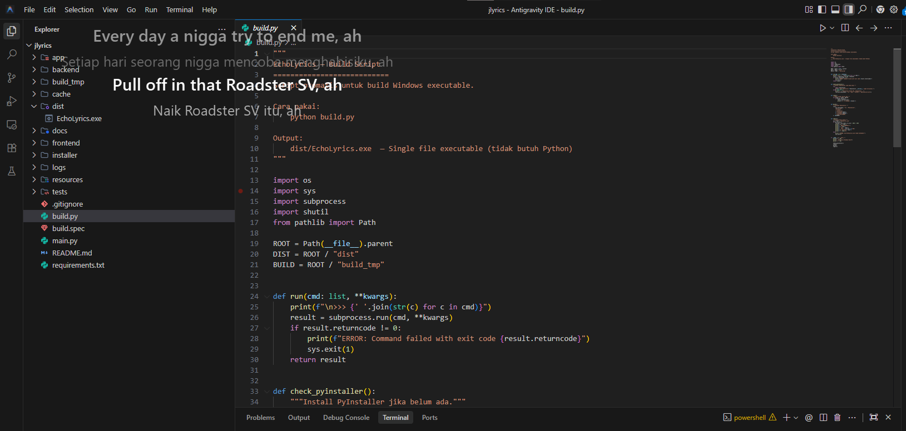
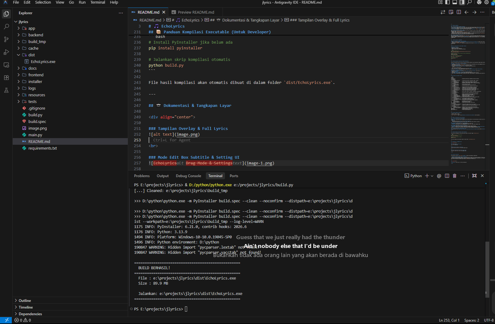
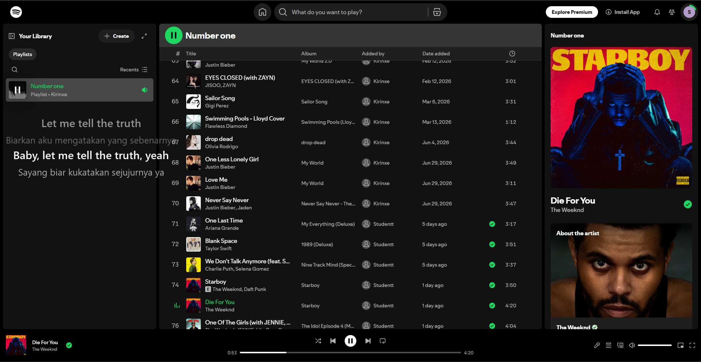

<div align="center">

# 🎵 EchoLyrics

**Overlay lirik Spotify real-time untuk Windows — dengan terjemahan Bahasa Indonesia.**

Lirik yang mengapung di atas layar, sinkron otomatis, tanpa border, tanpa ganggu aktivitas kamu.

[](https://github.com)
[](https://python.org)
[](LICENSE)

</div>

---

## Apa Itu EchoLyrics?

EchoLyrics adalah aplikasi desktop yang menampilkan lirik lagu Spotify secara transparan di atas semua jendela — seperti subtitle film, tapi untuk musik kamu.

Cocok buat yang sering kerja sambil dengerin musik dan pengen ngerti liriknya tanpa harus buka browser.

---

## Fitur Utama

| Fitur | Keterangan |
|-------|------------|
| 🎯 Sinkronisasi Real-time | Lirik muncul tepat waktu mengikuti lagu yang sedang diputar |
| 🌐 Terjemahan Indonesia | Lirik asli + terjemahan Bahasa Indonesia secara bersamaan |
| 👻 Click-Through | Overlay tidak mengganggu — mouse tetap bisa klik di baliknya |
| 🔝 Always On Top | Tampil di atas game, browser, IDE, apapun |
| 💾 Cache Offline | Lirik yang sudah diambil disimpan lokal, tidak unduh ulang |
| 🎨 Tema Fleksibel | Dark, Light, dan pengaturan warna sendiri |
| 📐 Multi-Monitor | Pilih sendiri mau tampil di layar mana |
| ⚡ Super Ringan | CPU idle < 1%, RAM < 100MB |

---

## Cara Install & Pakai

### Opsi A — Langsung Pakai (Tanpa Python)

> 📥 **Download tersedia di tab [Releases](https://github.com/majeri03/spotify-overlay-lyrics/releases/download/v1.0.0/EchoLyrics.exe) repositori ini.**

1. Buka tab **Releases** di halaman GitHub ini (sisi kanan atas)
2. Download file `EchoLyrics.exe` dari versi terbaru
3. Klik dua kali untuk jalankan — tidak perlu install Python atau apapun
4. Ikon tray akan muncul di pojok kanan bawah taskbar Windows kamu

### Opsi B — Jalankan dari Source Code

**Syarat:** Python 3.13+ sudah terinstall.

```bash
# Clone repositori
git clone https://github.com/USERNAME/echolyrics.git
cd echolyrics

# Install dependencies
pip install -r requirements.txt

# Jalankan
python main.py
```

---

## Setup Pertama Kali (Wajib)

Kamu perlu menghubungkan akun Spotify-mu. Ini prosesnya:

**Langkah 1 — Buat Spotify App (gratis)**
1. Buka [Spotify Developer Dashboard](https://developer.spotify.com/dashboard)
2. Login dengan akun Spotify kamu
3. Klik **Create App**
4. Isi nama apa saja, lalu di kolom **Redirect URI** masukkan: `http://localhost:8765/callback`
5. Salin **Client ID** dan **Client Secret** yang muncul

**Langkah 2 — Masukkan ke Aplikasi**
1. Jalankan EchoLyrics
2. Klik kanan ikon tray → **Settings**
3. Buka tab **Spotify**
4. Paste Client ID dan Client Secret tadi
5. Klik **Login Spotify**
6. Browser akan terbuka → login → tutup saja — selesai!

**Langkah 3 — Mulai Dengarkan**

Putar lagu di Spotify → lirik langsung muncul otomatis di layar kamu. 🎶

---


## Cara Build Sendiri (Untuk Developer)

Kalau kamu mau compile ulang jadi `.exe`:

```bash
# Pastikan PyInstaller sudah terinstall
pip install pyinstaller

# Jalankan build script
python build.py
```

Hasil build akan ada di folder `dist/EchoLyrics.exe`.

---

## Struktur Project

```
echolyrics/
├── app/                    # Bootstrap & inisialisasi komponen
├── backend/
│   ├── spotify/           # Koneksi Spotify, OAuth, playback
│   ├── lyrics/            # Pengambilan lirik, sinkronisasi, parser
│   ├── translate/         # Layanan terjemahan multi-provider
│   ├── database/          # SQLite, repositori, migrasi
│   ├── config/            # Manajemen konfigurasi & enkripsi
│   ├── events/            # Event bus antar komponen
│   └── scheduler/         # Ticker 1000ms & 250ms
├── frontend/
│   ├── overlay/           # Window overlay transparan
│   ├── tray/              # Ikon system tray & menu
│   └── windows/           # Settings, Full Lyrics
├── resources/             # Ikon dan aset visual
├── main.py                # Entry point
└── requirements.txt
```

---

## Tech Stack

| Komponen | Teknologi |
|----------|-----------|
| Bahasa | Python 3.13+ |
| UI Framework | PySide6 (Qt 6) |
| Database | SQLite 3 (WAL mode) |
| Sumber Lirik | LRCLIB API |
| Enkripsi Token | AES-256-GCM |
| Packaging | PyInstaller 6+ |

---

# Documentation




## Lisensi
MIT License — bebas dipakai, dimodifikasi, dan didistribusikan.
- "Aplikasi ini tidak menyimpan atau mendistribusikan lirik. Lirik ditampilkan sementara dari sumber pihak ketiga (LRCLIB) dan   merupakan milik pemegang hak cipta masing-masing." 
---

<div align="center">

Dibuat oleh J dan AiAgent.

</div>
